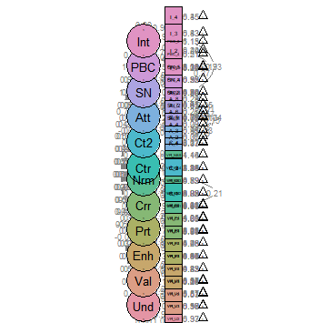

# Homework Repository

:warning:***ENTER AT YOU OWN RISK***:heavy_exclamation_mark: All files contained in this repository are likely just a jumble of nonsense.

## Description

This is my homework repository. During the spring semester of 2021, I will use this space to organize all of my files (data, scripts, output, etc.) for the Programming with Data class taught by Dr. Brenton Wiernik at the University of South Florida.

## About Me

Hello, my name is **Lendi Nicole Joy** and I'm excited about this course and I think/hope it will be *fun*! I've used R in the past for meta analysis and played around with some measurement models. Then when the pandemic started, R became my primary program for all my data analyses. I've run some [SEM](https://www.theanalysisfactor.com/four-types-sem/) models and made ~~many failed~~ attempts at creating visual representations of my data. For example:  
  *Here is a visual representation of a latent variable model.*  

  *Now here is my attempt to create the model in R.*  

  There is so much that you can do with R and I have always wanted to learn a computer language, but never made the time. So, I figured this class would be the perfect opportunity to make myself learn something useful.

## Homework Assignments

### Assignment 01: Tools for data analytic work

-   [x] Exercise 1: Edit README.md
-   [x] Exercise 2: RMarkdown for Dataset exploration
