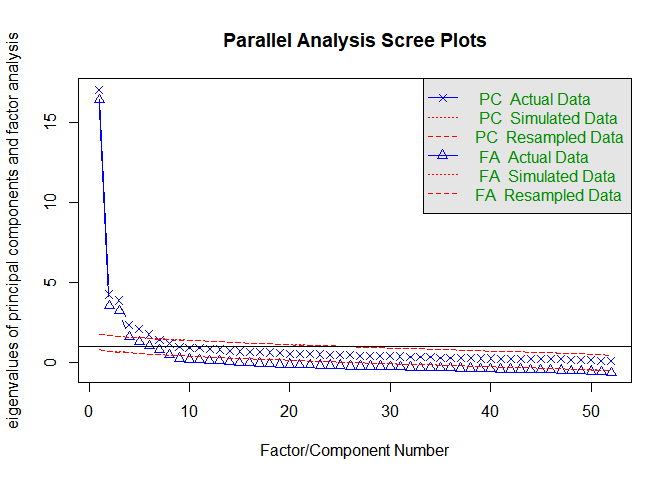

Final Project
================
Lendi Nicole Joy
5/3/2021

First load the needed libraries.

``` r
library(tidyverse)
```

    ## Warning: package 'tidyverse' was built under R version 4.0.5

    ## -- Attaching packages --------------------------------------- tidyverse 1.3.1 --

    ## v ggplot2 3.3.3     v purrr   0.3.4
    ## v tibble  3.0.6     v dplyr   1.0.4
    ## v tidyr   1.1.3     v stringr 1.4.0
    ## v readr   1.4.0     v forcats 0.5.1

    ## Warning: package 'tidyr' was built under R version 4.0.5

    ## -- Conflicts ------------------------------------------ tidyverse_conflicts() --
    ## x dplyr::filter() masks stats::filter()
    ## x dplyr::lag()    masks stats::lag()

``` r
library(GPArotation)
library(psych)
```

    ## Warning: package 'psych' was built under R version 4.0.5

    ## 
    ## Attaching package: 'psych'

    ## The following objects are masked from 'package:ggplot2':
    ## 
    ##     %+%, alpha

Second, load the dataset.

``` r
Motivation <- read_csv(here::here("data", "Activities_and_Mood.csv"))
```

Next, clean up the data using variable Q166\_7, which indicates whether
the survey was completed.

``` r
Motivation <- 
  Motivation %>% 
  drop_na("Q166_7")
```

There were 149 cases removed.

Now let’s select only the variables needed for the EFA (remove V4 and
V5, which are attention check items).

``` r
Motivation_EFA <- 
  Motivation %>% 
  select(VFI.U1:Int_4, -c(V4, V5))
```

After selecting the appropriate variables, I will reverse code the items
so that higher scores indicate more positive attitudes.

``` r
Motivation_EFA<-  
  8 - Motivation_EFA[, -c(31, 33:35, 52, 57)]
```

``` r
write.csv(Motivation_EFA,
          here::here("data", "Motivation_EFA.csv"))
```

Next, I will run a parallel analysis.

``` r
fa.parallel(Motivation_EFA)
```

<!-- -->

    ## Parallel analysis suggests that the number of factors =  7  and the number of components =  6

The parallel analysis suggests that there should be 7 factors.

Now, run the EFA.

``` r
fa(Motivation_EFA, nfactors = 7, fm = "pa", rotate = "oblimin")
```

    ## Factor Analysis using method =  pa
    ## Call: fa(r = Motivation_EFA, nfactors = 7, rotate = "oblimin", fm = "pa")
    ## Standardized loadings (pattern matrix) based upon correlation matrix
    ##           PA1   PA3   PA2   PA7   PA4   PA6   PA5   h2    u2 com
    ## VFI.U1   0.07  0.00 -0.01  0.07  0.23  0.56  0.11 0.53 0.471 1.5
    ## VFI.U2   0.10  0.03  0.20  0.10  0.17  0.47  0.00 0.56 0.436 1.9
    ## VFI.U3   0.09  0.07  0.14 -0.02  0.35  0.38  0.17 0.58 0.417 2.9
    ## VFI.U4   0.16 -0.05  0.19  0.03  0.17  0.32  0.15 0.41 0.588 3.5
    ## VFI.U5   0.00 -0.02  0.31  0.09  0.32  0.27  0.11 0.51 0.488 3.4
    ## VFI.V1   0.16  0.17  0.05  0.04 -0.15  0.53 -0.13 0.48 0.521 1.8
    ## VFI.V2   0.02  0.11  0.06  0.23 -0.15  0.38 -0.03 0.31 0.688 2.2
    ## VFI.V3   0.32  0.13  0.03  0.01 -0.04  0.51 -0.07 0.57 0.425 1.9
    ## VFI.V4   0.32  0.05  0.09 -0.03 -0.10  0.47 -0.01 0.51 0.494 2.0
    ## VFI.V5   0.24  0.07 -0.02  0.06  0.15  0.44  0.11 0.51 0.492 2.1
    ## VFI.E1   0.12  0.11  0.41 -0.05  0.15 -0.01  0.09 0.36 0.637 1.8
    ## VFI.E2   0.10  0.08  0.65 -0.01  0.13 -0.06 -0.01 0.57 0.426 1.2
    ## VFI.E3   0.03 -0.03  0.71  0.02  0.09  0.03  0.03 0.60 0.400 1.0
    ## VFI.E4   0.10  0.10  0.75 -0.05  0.06 -0.13  0.06 0.66 0.339 1.2
    ## VFI.E5  -0.06 -0.02  0.42 -0.04  0.32  0.11  0.11 0.41 0.589 2.2
    ## VFI.P1   0.09  0.10  0.50  0.13 -0.18  0.27 -0.06 0.54 0.456 2.2
    ## VFI.P2   0.01 -0.03  0.66 -0.08  0.03  0.09  0.07 0.49 0.506 1.1
    ## VFI.P3  -0.03  0.09  0.44 -0.01  0.14 -0.01 -0.03 0.28 0.722 1.3
    ## VFI.P4  -0.03  0.05  0.74  0.10 -0.03  0.02  0.00 0.59 0.413 1.1
    ## VFI.P5   0.04 -0.03  0.78  0.09 -0.05  0.04 -0.06 0.64 0.361 1.1
    ## VFI.C1   0.04  0.09 -0.03 -0.01  0.65 -0.01 -0.06 0.45 0.552 1.1
    ## VFI.C2   0.06  0.04  0.02 -0.03  0.75  0.06  0.00 0.63 0.370 1.0
    ## VFI.C3  -0.08 -0.01  0.18  0.01  0.49  0.25  0.05 0.44 0.557 1.9
    ## VFI.C4   0.04  0.06  0.09  0.20  0.61  0.11 -0.09 0.62 0.384 1.4
    ## VFI.C5   0.03 -0.02  0.10  0.01  0.73 -0.17 -0.05 0.57 0.433 1.2
    ## VFI.NB1  0.03  0.69 -0.08 -0.10 -0.06  0.10  0.00 0.44 0.557 1.1
    ## VFI.NB2 -0.06  0.78  0.00 -0.05  0.09 -0.02 -0.02 0.58 0.422 1.0
    ## VFI.NB3 -0.08  0.87  0.03 -0.03  0.01  0.02  0.00 0.72 0.281 1.0
    ## VFI.NB4 -0.13  0.73  0.05  0.04  0.04  0.05  0.03 0.56 0.435 1.1
    ## VFI.NB5  0.07  0.74  0.03 -0.03  0.07 -0.13 -0.01 0.57 0.435 1.1
    ## Ctrl_2  -0.13  0.27  0.01  0.22  0.10  0.14  0.32 0.36 0.636 3.9
    ## Att_1    0.78 -0.01 -0.06  0.06  0.09  0.06  0.06 0.74 0.256 1.1
    ## Att_2    0.76 -0.03  0.17  0.03 -0.10 -0.01  0.05 0.71 0.288 1.2
    ## Att_3    0.84  0.03  0.08 -0.06 -0.01 -0.02 -0.01 0.70 0.301 1.0
    ## Att_4    0.83  0.01  0.07 -0.02 -0.05  0.06  0.02 0.78 0.221 1.0
    ## Att_5    0.76  0.03 -0.01  0.14  0.07 -0.02 -0.01 0.74 0.257 1.1
    ## Att_6    0.78  0.02 -0.10  0.09  0.10  0.03  0.01 0.70 0.297 1.1
    ## Att_7    0.78  0.03  0.11 -0.02 -0.12  0.03  0.00 0.69 0.313 1.1
    ## Att_8    0.73 -0.01 -0.04  0.16  0.14  0.01 -0.02 0.71 0.291 1.2
    ## Att_9    0.79 -0.01 -0.01  0.00  0.04  0.06  0.06 0.71 0.291 1.0
    ## SN_1     0.05  0.71 -0.03  0.10 -0.03  0.14  0.01 0.67 0.335 1.1
    ## SN_2     0.02  0.74  0.05  0.09 -0.02  0.02  0.02 0.66 0.339 1.0
    ## SN_3     0.07  0.70  0.09  0.09 -0.07 -0.01 -0.01 0.62 0.376 1.1
    ## SN_4     0.21  0.28 -0.15  0.03  0.04  0.05  0.23 0.27 0.734 3.6
    ## SN_5     0.24  0.62 -0.05  0.10  0.03 -0.15  0.04 0.58 0.425 1.5
    ## PBC_1   -0.04 -0.04  0.03  0.03 -0.05 -0.02  0.73 0.52 0.481 1.0
    ## PBC_2    0.08  0.16  0.00  0.24 -0.03 -0.12  0.46 0.43 0.566 2.0
    ## PBC_4    0.22  0.03 -0.11  0.14  0.04  0.05  0.50 0.46 0.543 1.7
    ## PBC_5    0.03  0.00  0.04 -0.08 -0.10 -0.01  0.74 0.54 0.464 1.1
    ## Int_1    0.02  0.03  0.01  0.91 -0.01 -0.02  0.01 0.88 0.123 1.0
    ## Int_2   -0.02 -0.02  0.02  0.98  0.00  0.01  0.00 0.94 0.061 1.0
    ## Int_4    0.08  0.04 -0.01  0.84  0.01  0.00  0.03 0.85 0.155 1.0
    ## 
    ##                        PA1  PA3  PA2  PA7  PA4  PA6  PA5
    ## SS loadings           7.18 5.70 5.03 3.52 3.32 3.10 2.11
    ## Proportion Var        0.14 0.11 0.10 0.07 0.06 0.06 0.04
    ## Cumulative Var        0.14 0.25 0.34 0.41 0.48 0.54 0.58
    ## Proportion Explained  0.24 0.19 0.17 0.12 0.11 0.10 0.07
    ## Cumulative Proportion 0.24 0.43 0.60 0.72 0.83 0.93 1.00
    ## 
    ##  With factor correlations of 
    ##      PA1  PA3  PA2  PA7  PA4  PA6  PA5
    ## PA1 1.00 0.35 0.42 0.57 0.19 0.45 0.30
    ## PA3 0.35 1.00 0.31 0.44 0.18 0.26 0.17
    ## PA2 0.42 0.31 1.00 0.23 0.36 0.35 0.16
    ## PA7 0.57 0.44 0.23 1.00 0.19 0.25 0.26
    ## PA4 0.19 0.18 0.36 0.19 1.00 0.18 0.09
    ## PA6 0.45 0.26 0.35 0.25 0.18 1.00 0.12
    ## PA5 0.30 0.17 0.16 0.26 0.09 0.12 1.00
    ## 
    ## Mean item complexity =  1.5
    ## Test of the hypothesis that 7 factors are sufficient.
    ## 
    ## The degrees of freedom for the null model are  1326  and the objective function was  38.46 with Chi Square of  15570.33
    ## The degrees of freedom for the model are 983  and the objective function was  5.42 
    ## 
    ## The root mean square of the residuals (RMSR) is  0.03 
    ## The df corrected root mean square of the residuals is  0.03 
    ## 
    ## The harmonic number of observations is  424 with the empirical chi square  909.04  with prob <  0.96 
    ## The total number of observations was  424  with Likelihood Chi Square =  2168.68  with prob <  4e-91 
    ## 
    ## Tucker Lewis Index of factoring reliability =  0.886
    ## RMSEA index =  0.053  and the 90 % confidence intervals are  0.05 0.056
    ## BIC =  -3778.21
    ## Fit based upon off diagonal values = 0.99
    ## Measures of factor score adequacy             
    ##                                                    PA1  PA3  PA2  PA7  PA4  PA6
    ## Correlation of (regression) scores with factors   0.98 0.97 0.95 0.98 0.93 0.91
    ## Multiple R square of scores with factors          0.96 0.93 0.91 0.97 0.87 0.83
    ## Minimum correlation of possible factor scores     0.91 0.86 0.82 0.94 0.74 0.66
    ##                                                    PA5
    ## Correlation of (regression) scores with factors   0.89
    ## Multiple R square of scores with factors          0.79
    ## Minimum correlation of possible factor scores     0.59
