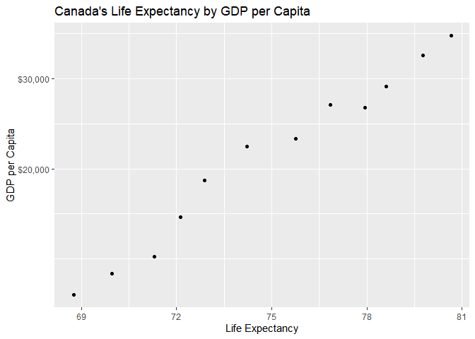
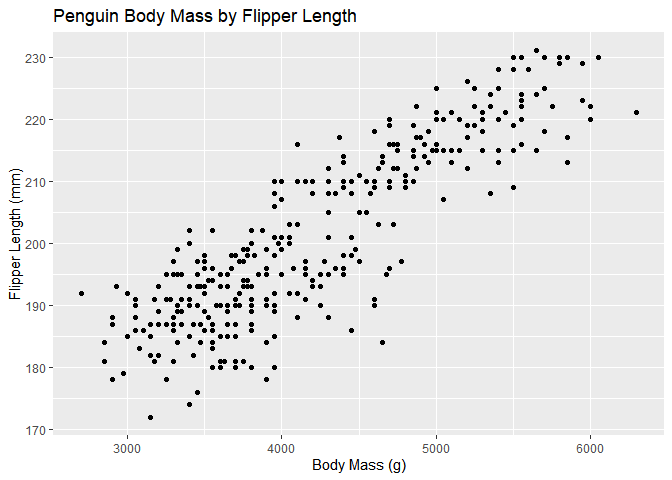
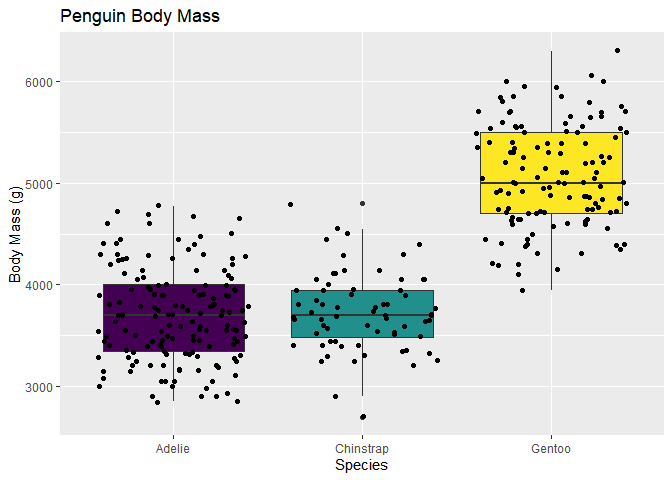

### Load Necessary Libraries 

```r
library(ggplot2)
library(gapminder)
library(dplyr)
```

```
## 
## Attaching package: 'dplyr'
```

```
## The following objects are masked from 'package:stats':
## 
##     filter, lag
```

```
## The following objects are masked from 'package:base':
## 
##     intersect, setdiff, setequal, union
```

### Exercise 1: Basic dplyr

## 1.1
Use filter() to subset the gapminder data to three countries of your choice in the 1970’s.

```r
filter(gapminder, country %in% c("Brazil","China","Niger"), year>=1970&year<=1979)
```

```
## # A tibble: 6 x 6
##   country continent  year lifeExp       pop gdpPercap
##   <fct>   <fct>     <int>   <dbl>     <int>     <dbl>
## 1 Brazil  Americas   1972    59.5 100840058     4986.
## 2 Brazil  Americas   1977    61.5 114313951     6660.
## 3 China   Asia       1972    63.1 862030000      677.
## 4 China   Asia       1977    64.0 943455000      741.
## 5 Niger   Africa     1972    40.5   5060262      954.
## 6 Niger   Africa     1977    41.3   5682086      809.
```

## 1.2
Use the pipe operator %>% to select “country” and “gdpPercap” from your filtered dataset in 1.1.

```r
gapminder %>% 
  filter(country %in% c("Brazil","China","Niger"), year>=1970&year<=1979) %>% 
  select(country, gdpPercap)
```

```
## # A tibble: 6 x 2
##   country gdpPercap
##   <fct>       <dbl>
## 1 Brazil      4986.
## 2 Brazil      6660.
## 3 China        677.
## 4 China        741.
## 5 Niger        954.
## 6 Niger        809.
```

## 1.3
Make a new variable in gapminder for the change in life expectancy from the previous measurement. Filter this table to show all of the entries that have experienced a drop in life expectancy.

Hint: you might find the lag() or diff() functions useful.

```r
gapminder %>% 
  mutate(lifeExp_change = lifeExp-lag(lifeExp))%>% 
  filter(lifeExp_change<0)
```

```
## # A tibble: 221 x 7
##    country    continent  year lifeExp      pop gdpPercap lifeExp_change
##    <fct>      <fct>     <int>   <dbl>    <int>     <dbl>          <dbl>
##  1 Albania    Europe     1992    71.6  3326498     2497.         -0.419
##  2 Algeria    Africa     1952    43.1  9279525     2449.        -33.3  
##  3 Angola     Africa     1952    30.0  4232095     3521.        -42.3  
##  4 Angola     Africa     1987    39.9  7874230     2430.         -0.036
##  5 Australia  Oceania    1952    69.1  8691212    10040.         -6.20 
##  6 Austria    Europe     1952    66.8  6927772     6137.        -14.4  
##  7 Bahrain    Asia       1952    50.9   120447     9867.        -28.9  
##  8 Bangladesh Asia       1952    37.5 46886859      684.        -38.2  
##  9 Benin      Africa     1952    38.2  1738315     1063.        -41.2  
## 10 Benin      Africa     2002    54.4  7026113     1373.         -0.371
## # ... with 211 more rows
```

## 1.4
Filter gapminder so that it shows the max GDP per capita experienced by each country.  

Hint: you might find the max() function useful here.

```r
gapminder %>% 
  select(country, gdpPercap) %>% 
  group_by(country) %>% 
  filter(gdpPercap== max(gdpPercap))
```

```
## # A tibble: 142 x 2
## # Groups:   country [142]
##    country     gdpPercap
##    <fct>           <dbl>
##  1 Afghanistan      978.
##  2 Albania         5937.
##  3 Algeria         6223.
##  4 Angola          5523.
##  5 Argentina      12779.
##  6 Australia      34435.
##  7 Austria        36126.
##  8 Bahrain        29796.
##  9 Bangladesh      1391.
## 10 Belgium        33693.
## # ... with 132 more rows
```

## 1.5
Produce a scatterplot of Canada’s life expectancy vs. GDP per capita using ggplot2, without defining a new variable. That is, after filtering the gapminder data set, pipe it directly into the ggplot() function. In your plot, put GDP per capita on a log scale.

```r
gapminder %>% 
  filter(country == "Canada") %>%  
  ggplot(aes(lifeExp, gdpPercap)) +
  geom_point()+
  scale_y_log10("GDP per Capita", labels = scales::dollar_format(largest_with_cents = 1)) +
  xlab('Life Expectancy') +
  ggtitle("Canada's Life Expectancy by GDP per Capita")
```

<!-- -->

# Exercise 2: Explore two variables with dplyr and ggplot2
Use palmerpenguins::penguins or another dataset of your choice. (Check out a dataset from the datasets R package if you want!)

## 2.1
Pick two quantitative variables to explore.  

1. Make a summary table of descriptive statistics for these variables using summarize().
   * Include whatever staistics you feel appropriate (mean, median sd, range, etc.).
2. Make a scatterplot of these variables using ggplot().

```r
palmerpenguins::penguins%>% 
  summarize(across(c(flipper_length_mm, body_mass_g),
            list(mean=mean, sd=sd), na.rm=TRUE))
```

```
## # A tibble: 1 x 4
##   flipper_length_mm_mean flipper_length_mm_sd body_mass_g_mean body_mass_g_sd
##                    <dbl>                <dbl>            <dbl>          <dbl>
## 1                   201.                 14.1            4202.           802.
```

```r
ggplot(palmerpenguins::penguins, aes(body_mass_g, flipper_length_mm))+
  geom_point() +
    ggtitle("Penguin Body Mass by Flipper Length") +
    xlab("Body Mass (g)") +
  ylab("Flipper Length (mm)")
```

```
## Warning: Removed 2 rows containing missing values (geom_point).
```

<!-- -->

## 2.2
Pick one categorical variable and one quantitative variable to explore.

1. Make a summary table giving the sample size (hint: n()) and descriptive statistics for the quantitative variable by group.
2. Make one or more useful plots to visualize these variables.

```r
palmerpenguins::penguins%>% 
  group_by(species) %>% 
  summarize(mass_mean=mean(body_mass_g, na.rm=TRUE),
            mas_sd=sd(body_mass_g, na.rm=TRUE), N=n()) 
```

```
## # A tibble: 3 x 4
##   species   mass_mean mas_sd     N
## * <fct>         <dbl>  <dbl> <int>
## 1 Adelie        3701.   459.   152
## 2 Chinstrap     3733.   384.    68
## 3 Gentoo        5076.   504.   124
```

```r
palmerpenguins::penguins%>% 
ggplot(aes(species, body_mass_g, fill=species))+
  geom_boxplot() +
scale_fill_viridis_d() +
    geom_jitter() +
    theme(legend.position="none") +
    ggtitle("Penguin Body Mass") +
    xlab("Species") +
  ylab("Body Mass (g)")
```

```
## Warning: Removed 2 rows containing non-finite values (stat_boxplot).
```

```
## Warning: Removed 2 rows containing missing values (geom_point).
```

<!-- -->

# Bonus Exercise: Recycling (Optional)
Evaluate this code and describe the result. The goal was to get the data for Rwanda and Afghanistan. Does this work? Why or why not? If not, what is the correct way to do this?

`filter(gapminder, country == c("Rwanda", "Afghanistan"))`


The above code would not work as written because it is requesting that R find an object called 'country' within the environment that is exactly equal to c("Rwanda", "Afghanistan"). Instead, country is a vector within the object 'gapminder'. The correct way to filter the data for Rwanda and Afghanistan would be as follows: `filter(gapminder, country %in% c("Rwanda" and "Afghanistan")).` This tells R to filter from the 'gapminer' object the elements "Rwanda" and "Afghanistan" within the vector 'country'.
