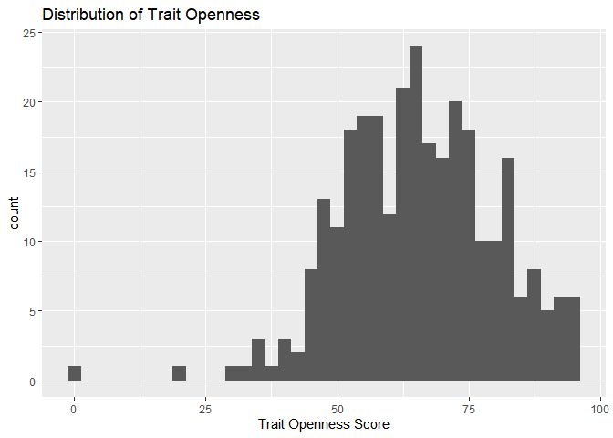
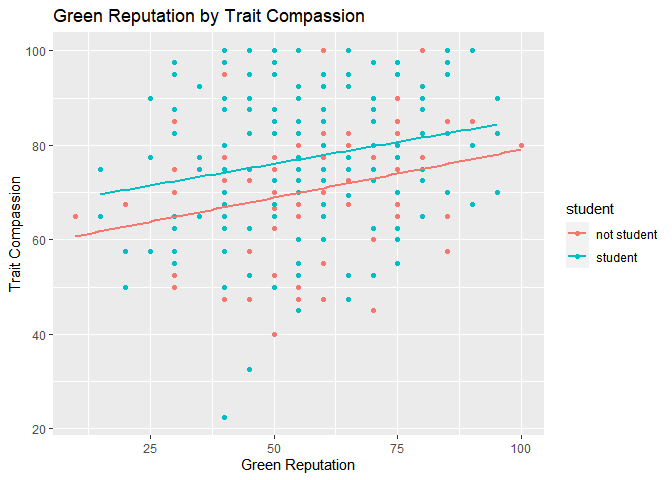
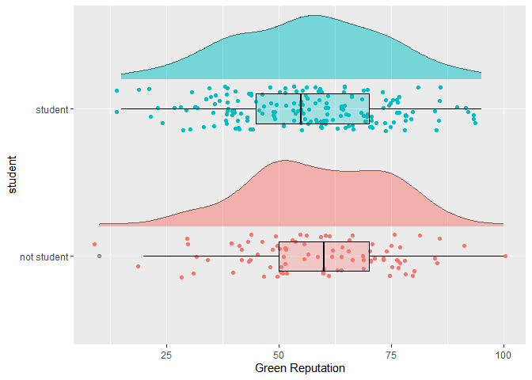

Green behavior and personality report
================
Lendi N. Joy
2/22/2021

# Homework 03

You will analyze data looking at the relationship between **green
reputation** and three personality traits–**compassion**, **intellectual
curiosity**, and **openness to experiences**. The dataset includes data
from **students** and **non-students**.

## Load the data.

``` r
dictionary <- readr::read_csv("green_dictionary.csv")
```

    ## 
    ## -- Column specification --------------------------------------------------------
    ## cols(
    ##   Item = col_character(),
    ##   Content = col_character(),
    ##   Options = col_character(),
    ##   Keying = col_double()
    ## )

``` r
green_data <- readr::read_csv("green_data.csv")
```

    ## 
    ## -- Column specification --------------------------------------------------------
    ## cols(
    ##   .default = col_double(),
    ##   id = col_character()
    ## )
    ## i Use `spec()` for the full column specifications.

## Load necessary libraries.

``` r
library(dplyr)
```

    ## 
    ## Attaching package: 'dplyr'

    ## The following objects are masked from 'package:stats':
    ## 
    ##     filter, lag

    ## The following objects are masked from 'package:base':
    ## 
    ##     intersect, setdiff, setequal, union

``` r
library(ggplot2)
```

## For your assignment, do the following.

### 1. Inspect the item responses (e.g., with graphs or by summarizing distinct values).

     Is anything unusual?

``` r
green_data %>% 
summary()
```

    ##       id                green1          green2         green3     
    ##  Length:373         Min.   :1.000   Min.   :1.00   Min.   :1.000  
    ##  Class :character   1st Qu.:3.000   1st Qu.:2.00   1st Qu.:3.000  
    ##  Mode  :character   Median :4.000   Median :3.00   Median :4.000  
    ##                     Mean   :3.476   Mean   :2.93   Mean   :3.797  
    ##                     3rd Qu.:4.000   3rd Qu.:4.00   3rd Qu.:4.000  
    ##                     Max.   :5.000   Max.   :5.00   Max.   :5.000  
    ##                     NA's   :58      NA's   :58     NA's   :58     
    ##      green4          green5          comp1             comp2        
    ##  Min.   :1.000   Min.   :1.000   Min.   :-99.000   Min.   :-99.000  
    ##  1st Qu.:3.000   1st Qu.:2.000   1st Qu.:  4.000   1st Qu.:  4.000  
    ##  Median :3.000   Median :3.000   Median :  4.000   Median :  4.000  
    ##  Mean   :3.238   Mean   :2.835   Mean   :  3.648   Mean   :  3.702  
    ##  3rd Qu.:4.000   3rd Qu.:4.000   3rd Qu.:  4.000   3rd Qu.:  4.500  
    ##  Max.   :5.000   Max.   :5.000   Max.   :  5.000   Max.   :  5.000  
    ##  NA's   :58      NA's   :58      NA's   :86        NA's   :78       
    ##      comp3           comp4             comp5             comp6      
    ##  Min.   :1.000   Min.   :-99.000   Min.   :-99.000   Min.   :1.000  
    ##  1st Qu.:4.000   1st Qu.:  4.000   1st Qu.:  4.000   1st Qu.:2.000  
    ##  Median :4.000   Median :  4.000   Median :  4.000   Median :2.000  
    ##  Mean   :4.267   Mean   :  3.691   Mean   :  3.319   Mean   :2.161  
    ##  3rd Qu.:5.000   3rd Qu.:  4.000   3rd Qu.:  4.000   3rd Qu.:3.000  
    ##  Max.   :5.000   Max.   :  5.000   Max.   :  5.000   Max.   :5.000  
    ##  NA's   :77      NA's   :85        NA's   :88        NA's   :81     
    ##      comp7            comp8             comp9             comp10       
    ##  Min.   :-99.00   Min.   :-99.000   Min.   :-99.000   Min.   :-99.000  
    ##  1st Qu.:  2.00   1st Qu.:  2.000   1st Qu.:  2.000   1st Qu.:  1.000  
    ##  Median :  2.00   Median :  2.000   Median :  2.000   Median :  2.000  
    ##  Mean   :  1.84   Mean   :  1.739   Mean   :  1.342   Mean   :  1.577  
    ##  3rd Qu.:  3.00   3rd Qu.:  2.000   3rd Qu.:  2.000   3rd Qu.:  2.000  
    ##  Max.   :  5.00   Max.   :  5.000   Max.   :  5.000   Max.   :  5.000  
    ##  NA's   :86       NA's   :90        NA's   :89        NA's   :89       
    ##      intel1           intel2            intel3            intel4       
    ##  Min.   :-99.00   Min.   :-99.000   Min.   :-99.000   Min.   :-99.000  
    ##  1st Qu.:  3.00   1st Qu.:  3.000   1st Qu.:  3.000   1st Qu.:  3.000  
    ##  Median :  4.00   Median :  4.000   Median :  4.000   Median :  4.000  
    ##  Mean   :  3.38   Mean   :  3.336   Mean   :  2.822   Mean   :  2.656  
    ##  3rd Qu.:  4.00   3rd Qu.:  4.000   3rd Qu.:  4.000   3rd Qu.:  4.000  
    ##  Max.   :  5.00   Max.   :  5.000   Max.   :  5.000   Max.   :  5.000  
    ##  NA's   :78       NA's   :90        NA's   :86        NA's   :88       
    ##      intel5            intel6            intel7            intel8       
    ##  Min.   :-99.000   Min.   :-99.000   Min.   :-99.000   Min.   :-99.000  
    ##  1st Qu.:  3.000   1st Qu.:  3.000   1st Qu.:  2.000   1st Qu.:  2.000  
    ##  Median :  4.000   Median :  4.000   Median :  2.000   Median :  2.000  
    ##  Mean   :  3.378   Mean   :  3.211   Mean   :  2.101   Mean   :  2.125  
    ##  3rd Qu.:  4.000   3rd Qu.:  4.000   3rd Qu.:  3.000   3rd Qu.:  3.000  
    ##  Max.   :  5.000   Max.   :  5.000   Max.   :  5.000   Max.   :  5.000  
    ##  NA's   :77        NA's   :89        NA's   :86        NA's   :78       
    ##      intel9           intel10            open1             open2        
    ##  Min.   :-99.000   Min.   :-99.000   Min.   :-99.000   Min.   :-99.000  
    ##  1st Qu.:  2.000   1st Qu.:  2.000   1st Qu.:  4.000   1st Qu.:  3.000  
    ##  Median :  2.000   Median :  2.000   Median :  4.000   Median :  4.000  
    ##  Mean   :  2.014   Mean   :  1.809   Mean   :  3.894   Mean   :  3.411  
    ##  3rd Qu.:  4.000   3rd Qu.:  3.000   3rd Qu.:  5.000   3rd Qu.:  4.000  
    ##  Max.   :  5.000   Max.   :  5.000   Max.   :  5.000   Max.   :  5.000  
    ##  NA's   :90        NA's   :90        NA's   :81        NA's   :81       
    ##      open3             open4             open5             open6        
    ##  Min.   :-99.000   Min.   :-99.000   Min.   :-99.000   Min.   :-99.000  
    ##  1st Qu.:  3.000   1st Qu.:  3.000   1st Qu.:  3.000   1st Qu.:  3.000  
    ##  Median :  4.000   Median :  4.000   Median :  4.000   Median :  4.000  
    ##  Mean   :  3.387   Mean   :  3.562   Mean   :  3.109   Mean   :  2.882  
    ##  3rd Qu.:  4.000   3rd Qu.:  5.000   3rd Qu.:  4.000   3rd Qu.:  4.000  
    ##  Max.   :  5.000   Max.   :  5.000   Max.   :  5.000   Max.   :  5.000  
    ##  NA's   :89        NA's   :85        NA's   :88        NA's   :84       
    ##      open7             open8           open9           open10      
    ##  Min.   :-99.000   Min.   :1.000   Min.   :1.000   Min.   :-99.00  
    ##  1st Qu.:  2.000   1st Qu.:2.000   1st Qu.:2.000   1st Qu.:  2.00  
    ##  Median :  3.000   Median :2.000   Median :2.000   Median :  2.00  
    ##  Mean   :  2.274   Mean   :2.599   Mean   :2.568   Mean   :  2.36  
    ##  3rd Qu.:  4.000   3rd Qu.:3.000   3rd Qu.:4.000   3rd Qu.:  4.00  
    ##  Max.   :  5.000   Max.   :5.000   Max.   :5.000   Max.   :  5.00  
    ##  NA's   :85        NA's   :84      NA's   :77      NA's   :90      
    ##     student       
    ##  Min.   :-99.000  
    ##  1st Qu.:  1.000  
    ##  Median :  2.000  
    ##  Mean   :  1.309  
    ##  3rd Qu.:  2.000  
    ##  Max.   :  2.000  
    ##  NA's   :95

Several variables appear to have missing values coded as -99, so we will
remove those. We will also recode student into a factor variable.

``` r
green_data <- na_if(green_data, "-99") 
green_data$student <- recode_factor(green_data$student, '1' = "not student", '2' = "student")
summary(green_data)
```

    ##       id                green1          green2         green3     
    ##  Length:373         Min.   :1.000   Min.   :1.00   Min.   :1.000  
    ##  Class :character   1st Qu.:3.000   1st Qu.:2.00   1st Qu.:3.000  
    ##  Mode  :character   Median :4.000   Median :3.00   Median :4.000  
    ##                     Mean   :3.476   Mean   :2.93   Mean   :3.797  
    ##                     3rd Qu.:4.000   3rd Qu.:4.00   3rd Qu.:4.000  
    ##                     Max.   :5.000   Max.   :5.00   Max.   :5.000  
    ##                     NA's   :58      NA's   :58     NA's   :58     
    ##      green4          green5          comp1           comp2      
    ##  Min.   :1.000   Min.   :1.000   Min.   :1.000   Min.   :1.000  
    ##  1st Qu.:3.000   1st Qu.:2.000   1st Qu.:4.000   1st Qu.:4.000  
    ##  Median :3.000   Median :3.000   Median :4.000   Median :4.000  
    ##  Mean   :3.238   Mean   :2.835   Mean   :4.007   Mean   :4.051  
    ##  3rd Qu.:4.000   3rd Qu.:4.000   3rd Qu.:4.000   3rd Qu.:4.750  
    ##  Max.   :5.000   Max.   :5.000   Max.   :5.000   Max.   :5.000  
    ##  NA's   :58      NA's   :58      NA's   :87      NA's   :79     
    ##      comp3           comp4           comp5           comp6      
    ##  Min.   :1.000   Min.   :1.000   Min.   :1.000   Min.   :1.000  
    ##  1st Qu.:4.000   1st Qu.:4.000   1st Qu.:4.000   1st Qu.:2.000  
    ##  Median :4.000   Median :4.000   Median :4.000   Median :2.000  
    ##  Mean   :4.267   Mean   :4.049   Mean   :4.042   Mean   :2.161  
    ##  3rd Qu.:5.000   3rd Qu.:4.000   3rd Qu.:4.000   3rd Qu.:3.000  
    ##  Max.   :5.000   Max.   :5.000   Max.   :5.000   Max.   :5.000  
    ##  NA's   :77      NA's   :86      NA's   :90      NA's   :81     
    ##      comp7           comp8           comp9           comp10     
    ##  Min.   :1.000   Min.   :1.000   Min.   :1.000   Min.   :1.000  
    ##  1st Qu.:2.000   1st Qu.:2.000   1st Qu.:2.000   1st Qu.:1.000  
    ##  Median :2.000   Median :2.000   Median :2.000   Median :2.000  
    ##  Mean   :2.192   Mean   :2.096   Mean   :2.053   Mean   :1.933  
    ##  3rd Qu.:3.000   3rd Qu.:2.000   3rd Qu.:2.000   3rd Qu.:2.000  
    ##  Max.   :5.000   Max.   :5.000   Max.   :5.000   Max.   :5.000  
    ##  NA's   :87      NA's   :91      NA's   :91      NA's   :90     
    ##      intel1          intel2          intel3          intel4     
    ##  Min.   :1.000   Min.   :1.000   Min.   :1.000   Min.   :1.000  
    ##  1st Qu.:3.000   1st Qu.:3.000   1st Qu.:3.000   1st Qu.:3.000  
    ##  Median :4.000   Median :4.000   Median :4.000   Median :4.000  
    ##  Mean   :3.728   Mean   :3.699   Mean   :3.537   Mean   :3.375  
    ##  3rd Qu.:4.000   3rd Qu.:4.000   3rd Qu.:4.000   3rd Qu.:4.000  
    ##  Max.   :5.000   Max.   :5.000   Max.   :5.000   Max.   :5.000  
    ##  NA's   :79      NA's   :91      NA's   :88      NA's   :90     
    ##      intel5          intel6          intel7          intel8     
    ##  Min.   :1.000   Min.   :1.000   Min.   :1.000   Min.   :1.000  
    ##  1st Qu.:3.000   1st Qu.:3.000   1st Qu.:2.000   1st Qu.:2.000  
    ##  Median :4.000   Median :4.000   Median :2.000   Median :2.000  
    ##  Mean   :3.725   Mean   :3.572   Mean   :2.455   Mean   :2.469  
    ##  3rd Qu.:4.000   3rd Qu.:4.000   3rd Qu.:3.000   3rd Qu.:3.000  
    ##  Max.   :5.000   Max.   :5.000   Max.   :5.000   Max.   :5.000  
    ##  NA's   :78      NA's   :90      NA's   :87      NA's   :79     
    ##      intel9         intel10          open1           open2      
    ##  Min.   :1.000   Min.   :1.000   Min.   :1.000   Min.   :1.000  
    ##  1st Qu.:2.000   1st Qu.:2.000   1st Qu.:4.000   1st Qu.:3.000  
    ##  Median :2.000   Median :2.000   Median :4.000   Median :4.000  
    ##  Mean   :2.733   Mean   :2.527   Mean   :4.247   Mean   :3.763  
    ##  3rd Qu.:4.000   3rd Qu.:3.000   3rd Qu.:5.000   3rd Qu.:4.000  
    ##  Max.   :5.000   Max.   :5.000   Max.   :5.000   Max.   :5.000  
    ##  NA's   :92      NA's   :92      NA's   :82      NA's   :82     
    ##      open3           open4          open5          open6           open7      
    ##  Min.   :1.000   Min.   :1.00   Min.   :1.00   Min.   :1.000   Min.   :1.000  
    ##  1st Qu.:3.000   1st Qu.:3.00   1st Qu.:3.00   1st Qu.:3.000   1st Qu.:2.000  
    ##  Median :4.000   Median :4.00   Median :4.00   Median :4.000   Median :3.000  
    ##  Mean   :3.749   Mean   :3.92   Mean   :3.83   Mean   :3.592   Mean   :2.983  
    ##  3rd Qu.:4.000   3rd Qu.:5.00   3rd Qu.:4.00   3rd Qu.:4.000   3rd Qu.:4.000  
    ##  Max.   :5.000   Max.   :5.00   Max.   :5.00   Max.   :5.000   Max.   :5.000  
    ##  NA's   :90      NA's   :86     NA's   :90     NA's   :86      NA's   :87     
    ##      open8           open9           open10            student   
    ##  Min.   :1.000   Min.   :1.000   Min.   :1.00   not student: 91  
    ##  1st Qu.:2.000   1st Qu.:2.000   1st Qu.:2.00   student    :186  
    ##  Median :2.000   Median :2.000   Median :2.00   NA's       : 96  
    ##  Mean   :2.599   Mean   :2.568   Mean   :2.72                    
    ##  3rd Qu.:3.000   3rd Qu.:4.000   3rd Qu.:4.00                    
    ##  Max.   :5.000   Max.   :5.000   Max.   :5.00                    
    ##  NA's   :84      NA's   :77      NA's   :91

### 2. Compute total scores for the four scales.

Recode variables as needed. [1]

``` r
green_data_comp <- green_data %>% 
   rowwise() %>% 
  mutate(across(c(green2, comp6:comp10, intel7:intel10, open7:open10), ~(6 - .x))) %>% 
  mutate(greenM = mean(c_across(starts_with("g")), na.rm = TRUE), 
         compM = mean(c_across(starts_with("c")), na.rm = TRUE), 
         intelM = mean(c_across(intel1:intel10), na.rm = TRUE), 
         openM = mean(c_across(starts_with("o")), na.rm = TRUE)) %>% 
  ungroup()
```

Now let’s take a look at the new dataframe.

``` r
green_data_comp
```

    ## # A tibble: 373 x 41
    ##    id    green1 green2 green3 green4 green5 comp1 comp2 comp3 comp4 comp5 comp6
    ##    <chr>  <dbl>  <dbl>  <dbl>  <dbl>  <dbl> <dbl> <dbl> <dbl> <dbl> <dbl> <dbl>
    ##  1 9099       4      4      5      4      3     2     5     4     4     2     4
    ##  2 6275       3      1      3      3      1     4     5     4     5     5     5
    ##  3 8116       4      4      5      4      3     4     5     5     4     5     5
    ##  4 8586       4      3      5      4      3     4     5     5     4     5     5
    ##  5 0406       3      4      4      4      4     4     4     4     4     4     4
    ##  6 5645       4      3      4      4      3     5     5     5     4     4     4
    ##  7 3788       1      5      1      1      1     3     3     3     3     3     3
    ##  8 8424       4      3      2      2      2     1     1     1     2     2     2
    ##  9 8450       4      4      3      5      2     4     4     4     4     4     5
    ## 10 0512       4      4      5      5      4     5     2     5     4     2     4
    ## # ... with 363 more rows, and 29 more variables: comp7 <dbl>, comp8 <dbl>,
    ## #   comp9 <dbl>, comp10 <dbl>, intel1 <dbl>, intel2 <dbl>, intel3 <dbl>,
    ## #   intel4 <dbl>, intel5 <dbl>, intel6 <dbl>, intel7 <dbl>, intel8 <dbl>,
    ## #   intel9 <dbl>, intel10 <dbl>, open1 <dbl>, open2 <dbl>, open3 <dbl>,
    ## #   open4 <dbl>, open5 <dbl>, open6 <dbl>, open7 <dbl>, open8 <dbl>,
    ## #   open9 <dbl>, open10 <dbl>, student <fct>, greenM <dbl>, compM <dbl>,
    ## #   intelM <dbl>, openM <dbl>

### 3. Rescale the variables so that they go from 0-100 instead of the original range.

Name the rescaled variables `*_pomp`. [2]

``` r
green_data_pomp <- select(green_data_comp, c(id, student:openM)) %>% 
 rowwise() %>% 
  mutate(across(c(greenM:openM), ~((.x - 1) / (5 - 1) * 100), 
                .names = "{.col}_pomp")) %>% 
  ungroup()
green_data_pomp
```

    ## # A tibble: 373 x 10
    ##    id    student    greenM compM intelM openM greenM_pomp compM_pomp intelM_pomp
    ##    <chr> <fct>       <dbl> <dbl>  <dbl> <dbl>       <dbl>      <dbl>       <dbl>
    ##  1 9099  student       4     3.7    2.8  3.5          75        67.5        45.0
    ##  2 6275  student       2.2   4.8    3.5  3.1          30.       95          62.5
    ##  3 8116  student       4     4.4    3.6  3.9          75        85.         65  
    ##  4 8586  student       3.8   4.6    3    3.9          70        90.0        50  
    ##  5 0406  student       3.8   4      3.7  3.7          70        75          67.5
    ##  6 5645  student       3.6   4.2    3.8  3.8          65        80          70  
    ##  7 3788  student       1.8   3      3    3            20        50          50  
    ##  8 8424  student       2.6   1.9    4.3  1.8          40        22.5        82.5
    ##  9 8450  not stude~    3.6   4.2    4    4.33         65        80          75  
    ## 10 0512  student       4.4   3.8    3.7  3.8          85.       70          67.5
    ## # ... with 363 more rows, and 1 more variable: openM_pomp <dbl>

### 4. Make plots that illustrate the distributions of the 4 POMP-scored variables.

``` r
green_data_pomp %>% 
ggplot(
  aes(greenM_pomp)) +
  geom_histogram(binwidth = 5) +
  xlab("Green Score") +
  ggtitle("Distribution of Green Reputation")
```

    ## Warning: Removed 58 rows containing non-finite values (stat_bin).

<!-- -->

Green reputation score appears to be relatively normally distributed.

``` r
green_data_pomp %>% 
ggplot(
  aes(compM_pomp)) +
  geom_histogram(binwidth = 3) +
  xlab("Trait Compassion Score") +
  ggtitle("Distribution of Trait Compassion")
```

    ## Warning: Removed 77 rows containing non-finite values (stat_bin).

<!-- -->

Trait compassion has a slight left skew, but overall appears to be
normally distributed. There may possibly a few outliers to examine.

``` r
green_data_pomp %>% 
ggplot(
  aes(intelM_pomp)) +
  geom_histogram(binwidth = 2.5) +
  xlab("Intellectual Curiosity Score") +
  ggtitle("Distribution of Intellectual Curiosity")
```

    ## Warning: Removed 77 rows containing non-finite values (stat_bin).

<!-- -->

Trait intellectual curiosity appears normally distributed.

``` r
green_data_pomp %>% 
ggplot(
  aes(openM_pomp)) +
  geom_histogram(binwidth = 2.5) +
  xlab("Trait Openness Score") +
  ggtitle("Distribution of Trait Openness")
```

    ## Warning: Removed 77 rows containing non-finite values (stat_bin).

<!-- -->

Trait openness appears mostly normally distributed. There may be a few
outliers on the lower end to examine.

### 5. Make scatterplots showing the relationships between **green reputation** and each personality trait.

     Include trend lines for **students** and **non-students**.
     What do these plots show?
     

``` r
green_data_pomp %>% 
  filter(!is.na(student)) %>% 
    ggplot(aes(greenM_pomp, compM_pomp, color = student)) +
  geom_point() +
  geom_smooth(method="lm",se = FALSE) +
  ggtitle("Green Reputation by Trait Compassion") +
  xlab("Green Reputation") +
  ylab("Trait Compassion")
```

    ## `geom_smooth()` using formula 'y ~ x'

<!-- -->

Students appear to be slightly higher on trait compassion than
non-students. Although it appears that there may be an interaction
effect of student status on the relationship between trait compassion
and green reputation such that non-students score higher than students
on trait compassion when green reputation is low, but lower on trait
compassion when green reputation is higher.

``` r
green_data_pomp %>% 
  filter(!is.na(student)) %>% 
    ggplot(aes(greenM_pomp, intelM_pomp, color = student)) +
  geom_point() +
  geom_smooth(method="lm",se = FALSE) +
  ggtitle("Green Reputation by Intellectual Curiosity") +
  xlab("Green Reputation") +
  ylab("Intellectual Curiosity")
```

    ## `geom_smooth()` using formula 'y ~ x'

<!-- -->

Non-students appear to be slightly higher on intellectual curiosity than
students. Although it appears that there may be an interaction effect of
student status on the relationship between intellectual curiosity and
green reputation such that non-students score lower than students on
intellectual curiosity when green reputation is low, while students are
higher on trait compassion than non-students when green reputation is
higher.

``` r
green_data_pomp %>% 
  filter(!is.na(student)) %>% 
    ggplot(aes(greenM_pomp, openM_pomp, color = student)) +
  geom_point() +
  geom_smooth(method="lm",se = FALSE) +
  ggtitle("Green Reputation by Trait Openness") +
  xlab("Green Reputation") +
  ylab("Trait Openness")
```

    ## `geom_smooth()` using formula 'y ~ x'

<!-- -->

Students appear to be slightly higher on trait openness than
non-students. Although it appears that there may be an interaction
effect of student status on the relationship between trait openness and
green reputation such that non-students score higher than students on
trait openness when green reputation is low, but lower on trait openness
when green reputation is higher.

### 6. Compare **green reputation** for students and non-students using a **rainfall plot** (bar + density + data points).

``` r
green_data_pomp %>% 
  filter(!is.na(student)) %>% 
  ggplot() +
  aes(y = student, x = greenM_pomp, fill = student, color = student) +
  geom_jitter(height =.15) +
  geom_boxplot(color = "black", alpha = .3, width = .2, size = .4) +
  xlab("Green Reputation") +
  theme(legend.position = "none") +
  ggdist::stat_slab(height = .5, color = "black", size = .4,
                    alpha = .5,
                    position = position_nudge(y = .2))
```

<!-- -->

### 7. Compute a summary table of means, SDs, medians, minima, and maxima for the four total scores for students and non-students.

We can create a summary table like this:

``` r
green_data_pomp %>% 
  filter(!is.na(student)) %>% 
  group_by(student) %>% 
  summarize(across(c(greenM_pomp:openM_pomp),
                   list(mean = ~mean(., na.rm=TRUE), sd = ~sd(., na.rm=TRUE), 
                        meadian = ~median(., na.rm=TRUE), min = ~min(., na.rm=TRUE), 
                        max = ~max(., na.rm=TRUE))))
```

    ## # A tibble: 2 x 21
    ##   student     greenM_pomp_mean greenM_pomp_sd greenM_pomp_meadi~ greenM_pomp_min
    ## * <fct>                  <dbl>          <dbl>              <dbl>           <dbl>
    ## 1 not student             58.7           16.5                60             10.0
    ## 2 student                 56.4           17.1                55.            15. 
    ## # ... with 16 more variables: greenM_pomp_max <dbl>, compM_pomp_mean <dbl>,
    ## #   compM_pomp_sd <dbl>, compM_pomp_meadian <dbl>, compM_pomp_min <dbl>,
    ## #   compM_pomp_max <dbl>, intelM_pomp_mean <dbl>, intelM_pomp_sd <dbl>,
    ## #   intelM_pomp_meadian <dbl>, intelM_pomp_min <dbl>, intelM_pomp_max <dbl>,
    ## #   openM_pomp_mean <dbl>, openM_pomp_sd <dbl>, openM_pomp_meadian <dbl>,
    ## #   openM_pomp_min <dbl>, openM_pomp_max <dbl>

This works, but it doesn’t look the best…

So, let’s create a nicer table for the HTML page.

1.  First, load the ‘table1’ package.

``` r
library(table1)
```

    ## 
    ## Attaching package: 'table1'

    ## The following objects are masked from 'package:base':
    ## 
    ##     units, units<-

1.  Next, we will create variable labels for a more aesthetically
    pleasing look.

``` r
label(green_data_pomp$greenM_pomp) <- "Green Reputation"
label(green_data_pomp$compM_pomp) <- "Compassion"
label(green_data_pomp$intelM_pomp) <- "Intellectual Curiosity"
label(green_data_pomp$openM_pomp) <- "Openness to Experience"
```

1.  Finally, we will compute the summary table and group the results by
    student status.

``` r
table1(~greenM_pomp + compM_pomp + intelM_pomp + openM_pomp | student, 
       data = green_data_pomp, render.missing = NULL)
```

    ## [1] "<table class=\"Rtable1\">\n<thead>\n<tr>\n<th class='rowlabel firstrow lastrow'></th>\n<th class='firstrow lastrow'><span class='stratlabel'>not student<br><span class='stratn'>(N=91)</span></span></th>\n<th class='firstrow lastrow'><span class='stratlabel'>student<br><span class='stratn'>(N=186)</span></span></th>\n<th class='firstrow lastrow'><span class='stratlabel'>Overall<br><span class='stratn'>(N=373)</span></span></th>\n</tr>\n</thead>\n<tbody>\n<tr>\n<td class='rowlabel firstrow'><span class='varlabel'>Green Reputation</span></td>\n<td class='firstrow'></td>\n<td class='firstrow'></td>\n<td class='firstrow'></td>\n</tr>\n<tr>\n<td class='rowlabel'>Mean (SD)</td>\n<td>58.7 (16.5)</td>\n<td>56.4 (17.1)</td>\n<td>57.1 (16.9)</td>\n</tr>\n<tr>\n<td class='rowlabel lastrow'>Median [Min, Max]</td>\n<td class='lastrow'>60.0 [10.0, 100]</td>\n<td class='lastrow'>55.0 [15.0, 95.0]</td>\n<td class='lastrow'>55.0 [10.0, 100]</td>\n</tr>\n<tr>\n<td class='rowlabel firstrow'><span class='varlabel'>Compassion</span></td>\n<td class='firstrow'></td>\n<td class='firstrow'></td>\n<td class='firstrow'></td>\n</tr>\n<tr>\n<td class='rowlabel'>Mean (SD)</td>\n<td>70.7 (13.1)</td>\n<td>77.3 (14.6)</td>\n<td>75.0 (14.3)</td>\n</tr>\n<tr>\n<td class='rowlabel lastrow'>Median [Min, Max]</td>\n<td class='lastrow'>72.5 [40.0, 100]</td>\n<td class='lastrow'>76.3 [22.5, 100]</td>\n<td class='lastrow'>75.0 [22.5, 100]</td>\n</tr>\n<tr>\n<td class='rowlabel firstrow'><span class='varlabel'>Intellectual Curiosity</span></td>\n<td class='firstrow'></td>\n<td class='firstrow'></td>\n<td class='firstrow'></td>\n</tr>\n<tr>\n<td class='rowlabel'>Mean (SD)</td>\n<td>65.1 (13.7)</td>\n<td>63.0 (14.2)</td>\n<td>63.7 (14.0)</td>\n</tr>\n<tr>\n<td class='rowlabel lastrow'>Median [Min, Max]</td>\n<td class='lastrow'>67.5 [37.5, 95.0]</td>\n<td class='lastrow'>65.0 [25.0, 97.5]</td>\n<td class='lastrow'>65.0 [25.0, 97.5]</td>\n</tr>\n<tr>\n<td class='rowlabel firstrow'><span class='varlabel'>Openness to Experience</span></td>\n<td class='firstrow'></td>\n<td class='firstrow'></td>\n<td class='firstrow'></td>\n</tr>\n<tr>\n<td class='rowlabel'>Mean (SD)</td>\n<td>64.3 (12.5)</td>\n<td>66.4 (14.8)</td>\n<td>65.5 (14.5)</td>\n</tr>\n<tr>\n<td class='rowlabel lastrow'>Median [Min, Max]</td>\n<td class='lastrow'>62.5 [37.5, 95.0]</td>\n<td class='lastrow'>65.8 [20.0, 95.0]</td>\n<td class='lastrow'>65.0 [0, 95.8]</td>\n</tr>\n</tbody>\n</table>\n"

[1] I wasn’t sure if this should be a sum or mean and since ‘id’ starts
with “i”, we had to use a different method to compute the composite
score.

[2] I wasn’t sure if this should be all variables or just the composite
variables.
